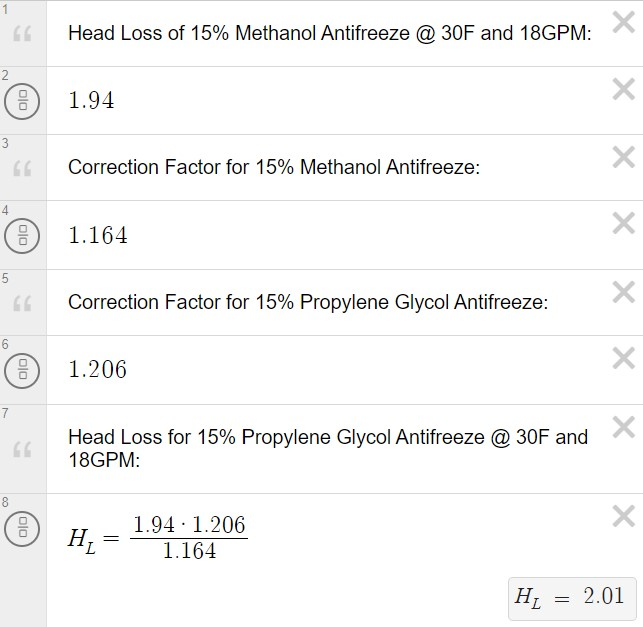

# TFD HW2B - William Van Dyke

## Question #1
### i.)
In Question #1 the headloss of the heat pump needs to be found when the system is using 15% propylene-glycol antifreeze at a temperature of 30 degrees fahrenheit and a flow rate of 18 GPM. The data provided in Fig.2 was found using 15% methanol antifreeze. Therefore, to calculate the needed values the correction values for 15% methanol antifreeze and 15% propylene-glycol must be found. These values are found in Fig.1.  

Next the headloss of the heatpump at the design conditions can be found in Fig.2. This value is then corrected by using the correction factors found in Fig.1. These calculations are shown in Fig.3.

<figcaption align = "center"><b>Fig.1 - Heat Exchanger Antifreeze Correction Values</b></figcaption>

<figcaption align = "center"><b>Fig.2 - Heat Exchanger Headloss for Methanol Antifreeze</b></figcaption>

<figcaption align = "center"><b>Fig.3 - Calculations to find Headloss for 15% Propylene-Glycol</b></figcaption>

## ii.)
Question #1 also asked to find the K value corresponding to the piping diameter for the design flow rate. To find the K value it is important to have the heat pump headloss, fluid velocity, and acceleration due to gravity.  
To find velocity, the flow rate is divided by the cross-sectional area of the pipe. The problem statement specifies 2 inch SRD-11 piping, the dimensions for this are found in Fig.4. All of the calculations required to find the K value are shown in Fig.5.

<figcaption align = "center"><b>Fig.4 - SRD-11 Piping Dimensions</b></figcaption>

<figcaption align = "center"><b>Fig.5 - Calculations to find the K Value Corresponding to The Piping Diameter for the Design Flow Rate</b></figcaption>

## Question #2
In Question #2 the headloss caused by the systems fittings, also known as minor loss, are to be found. The system contains 8x 90 degree elbows. To calculate the minor headloss the K values, velocity and acceleration due to gravity are needed. The K value for 2 inch SRD-11 90 degree elbow fittings are found in Fig.6. The velocity is the same as the velocity calculated in Question #1 part ii. The calculations to find the Minor Loss are presented in Fig.7.

<figcaption align = "center"><b>Fig.6 - K Values Corresponding to SRD-11 Elbows</b></figcaption>

<figcaption align = "center"><b>Fig.7 - Calculations to find the Minor Headloss due to Fittings</b></figcaption>

## Question #3
Question #3 asked to calculate the headloss caused from the straight piping, also known as Major Loss. To find Major Loss the friction factor, length of piping, diameter of pipe, velocity of the fluid, and acceleration due to gravity are required. Thus, friction factor must be calculated. The first step of finding friction factor is calculating the Reynolds Number. Reynolds Number is calculated using the velocity of the fluid, diameter of the pipe, and kinematic-viscosity of the fluid. The velocity is found in Question #1 part ii. The Diameter for 2 inch SDR-11 piping is found on Fig.4. The kinematic-viscosity of 15% Propylene Glycol at 30 degrees Farenheit was found using the Engineering Equation Solver (EES) software. The calculations to find Reynolds Number are shown in Fig.8. 

<figcaption align = "center"><b>Fig.8 - Calculations to find Reynolds Number</b></figcaption>

The Reynolds Number for this system indicates that the flow is turbulent. Because the flow is turbulent it is safe to use Swamee and Jaine Equation to find Friction Factor. The last thing needed to find friction factor is the relative roughness for SRD-11 piping, which was found in literature. The calculations to find Friction Factor are shown in Fig.9.

<figcaption align = "center"><b>Fig.9 - Calculations to find Friction Factor</b></figcaption>

Now that Friction Factor has been calculated it is possible to find the Major Loss. Fig.10 displays the calculations used to find the Major Loss.

<figcaption align = "center"><b>Fig.10 - Calculations to find Major Loss</b></figcaption>

## Question #4
Question #4 required the Headloss from the heat exchangers to be found. The problem statement provided the relationship between headloss and flowrate. However, this relationship was not based on a 15% Propylene Glycol brine flowing through it, therefore, it is nescesary to apply a correction which was provided in the problem statement. The calculations for the heat exchanger headloss are presnted in Fig.11.

<figcaption align = "center"><b>Fig.11 - Calculations to find the Heat Exchanger Headloss</b></figcaption>

## Question #6
Question #6 requested a summary of all the losses in this systems loop. A summary for the Total Headloss is shown in Fig.12.

<figcaption align = "center"><b>Fig.12 - Summary of Total Headloss</b></figcaption>

## Question #5
Question #5 asked for a tool developed by the student that will calculate the losses caused by the heat exchanger as a function of flow rate. The tool was developed in Python and is shown below. 

    def calc_heat_exchanger_head_loss(flow_rate:int,correction_factor:int=1):
        head_loss = (0.0066*(flow_rate**2)-0.12*flow_rate+5.6053) * correction_factor
        return head_loss

    calc_heat_exchanger_head_loss(18,1.21)

## Question #7 and Question #8
Questions #7 and #8 were closely related. In Question #7 the student was asked to select a pump based on the flowrate and required headloss. Fig.13 shows the design requirements, then selecting the closest minimally oversized pump the outcome is the Taco Circulator 0011. 

<figcaption align = "center"><b>Fig.13 - Taco Circulator Pump Selction</b></figcaption>

The rest of Question #7 and Question #8 ask the student to develp a tool that plots the pump curve using data points collected from the Fig.13 and plots the system curve. The tool should also plot the system's Actual Opperating Point (AOP). This tool is shown below and was developed with Python. 

    pump_head_loss = [31.5,30.8,30,29,28.5,27.5,26.8,25.8,25,24,23,22,21,20.1,19,18.1,17,16.1,15,14,12.9,11.9,10.8,9.5,8.4,7.2,6,5,3.8,2,0.8,0]

    def plot_system_and_pump_curve(pump_head_loss:list[int],total_head_loss:int,flow_rate:int):

        # FIND EQUATION FOR PUMP CURVE
        flow_rates = np.linspace(0,len(pump_head_loss)-1,len(pump_head_loss))
        pump_curve = np.poly1d(np.polyfit(x=flow_rates,y=pump_head_loss,deg=3))

        # CALCULATE THE K VALUE FO RTHE SYSTEM CURVE
        k = total_head_loss/(flow_rate**2)

        # CALCULATE HEADLOSS FOR AND EQUATION FOR SYSTEM CURVE
        system_head_loss = []
        for i in range(len(pump_head_loss)):
            aop = k*(flow_rates[i]**2)
            system_head_loss.append(aop)
        
        # PLOT PUMP CURVE
        plt.plot(flow_rates,pump_curve(flow_rates))
        # PLOT SYSTEM CURVE
        plt.plot(flow_rates,system_head_loss)
        # PLOT AOP FOR 18-GPM
        plt.scatter(x=flow_rate,y=total_head_loss,color="orange")

        # MAKE THE PLOT LOOK NICE
        plt.title("Pump and System Curve")    
        plt.legend(['Pump','System'])
        plt.xlabel("Flow Rate - GPM")
        plt.ylabel("Head Loss - feet")
        plt.margins(x=0,y=0)
        plt.grid(which="major")
        plt.yticks(ticks=[0,2,4,6,8,10,12,14,16,18,20,22,24,26,28,30,32,34,36,38,40,42])
        plt.xticks(ticks=[0,2,4,6,8,10,12,14,16,18,20,22,24,26,28,30,32])

        # SAVE FIGURE    
        plt.savefig("pump_curve.png")

    plot_system_and_pump_curve(pump_head_loss=pump_head_loss,total_head_loss=14.1961,flow_rate=18)

In the above code the list titled "pump_head_loss" represents the headloss of the Taco Circulator 0011 that was collected based on Fig.13. The result of running the above tool is show in Fig.14.

<figcaption align = "center"><b>Fig.14 - Pump and System Curve</b></figcaption>

The orange dot represents the systems AOP.